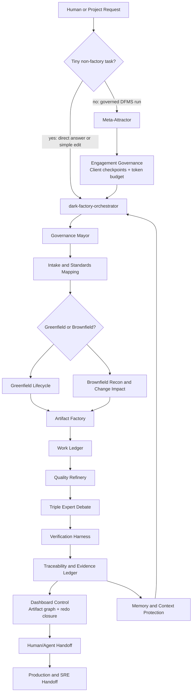

# 00. System Design

## Name

Dark Factory Meta-Skills Control Plane, abbreviated `DFMS`.

## Mission

Build a Codex-triggerable meta-skill hierarchy that can take either:

1. A new product or feature request.
2. A brownfield codebase change.
3. A post-development production, maintenance, or SRE handoff task.

and run it through a professional, standards-based software factory that produces:

- Working software.
- Full SDLC artifacts.
- Bidirectional traceability.
- Expert debates and review records.
- Quality certificates.
- Production and maintenance handoff packages.
- A living project book of knowledge.

The app is not "generate code and call it done." It is a governance and evidence system around agentic software delivery.

## Non-Negotiables From The Spec

- Every node has explicit `what`, `why`, `how`, `where`, `when`, `who`, and `how good`.
- Every node has at least 3 expert perspectives before decision.
- Every material artifact is reviewed by selected expert roles using 15-point rubrics.
- Every important decision has alternatives, debate, chosen rationale, rejected rationale, and risk.
- Every artifact has standards mapping, trace links, evidence, review state, and acceptance state.
- Humans can take over from agents at any stage.
- Agents can hand work back to humans at any stage.
- The client/dark-factory relationship is explicit, like a high-trust outsourcing engagement: scope, checkpoint cadence, iteration approvals, and acceptance gates are visible.
- Token spend is governed like budget: rough low/mid/high SWAGs, assumptions, exclusions, approvals, and reapproval triggers are recorded before material work.
- Software is iterative: every material iteration has an approved objective, token range, change-control path, and client checkpoint.
- Greenfield and brownfield projects are both first-class.
- Production and SRE handoff are first-class, even if humans retain production ownership.
- Context rot is treated as a design enemy, not an inconvenience.
- The system must be installable as Codex skills, with progressive disclosure and reusable resources.

## Standards Baseline

Checked on 2026-04-24 using official or primary sources.

| Area | Baseline | Use In DFMS |
| --- | --- | --- |
| Software life cycle process | [ISO/IEC/IEEE 12207:2017](https://www.iso.org/standard/63712.html), still current and confirmed in 2023; ISO notes an expected replacement in coming months | Process groups, lifecycle outcomes, agreement, technical management, technical, and support process coverage |
| Life-cycle information items | [ISO/IEC/IEEE 15289:2019](https://www.iso.org/standard/74909.html), current documentation content standard | Artifact purpose/content model and allowed combining/subdividing of information items |
| AI management | [ISO/IEC 42001:2023](https://www.iso.org/standard/42001) | AI governance, risk, monitoring, and improvement controls for the agentic factory itself |
| Secure SDLC | [NIST SP 800-218 SSDF 1.1 final](https://csrc.nist.gov/publications/detail/sp/800-218/final), with [SP 800-218 Rev. 1 / SSDF 1.2 draft](https://csrc.nist.gov/pubs/sp/800/218/r1/ipd) tracked as an update candidate | Security practices, vulnerability prevention, supplier/acquirer communication |
| Software assurance maturity | [OWASP SAMM](https://devguide.owasp.org/en/08-culture-process/03-samm/) | Security governance, design, implementation, verification, and operations maturity |
| Model-driven architecture | [OMG MDA](https://www.omg.org/mda/) and [MDA specifications](https://www.omg.org/mda/specs.htm) | CIM/PIM/PSM modeling and transformation discipline |
| Modeling notation | [OMG UML 2.5.1](https://www.omg.org/spec/UML) | UML-based model artifacts when the chosen project needs formal modeling |
| Process maturity | [CMMI V3.0 alignment](https://www.isaca.org/about-us/newsroom/press-releases/2024/isacas-cmmi-certification-pathways-courses-and-exams-updated-to-align-with-cmmi) | Capability maturity, measurement, governance, and improvement |
| Multi-agent orchestration reference | [Gas Town](https://github.com/gastownhall/gastown) | Mayor, rigs, polecats, beads, molecules, refinery, escalation, seance-like context recovery |

Important correction: the transcript sometimes says `ISO 12207:2026`. The verified current software life cycle standard is `ISO/IEC/IEEE 12207:2017` as of 2026-04-24, with a replacement expected but not assumed. DFMS must version its standards baseline and include a standards-watch step.

## Architecture

DFMS is a skill-based control plane, not a single monolithic app.

Governed DFMS work must enter through the Meta-Attractor. The direct path to `dark-factory-orchestrator` is reserved only for tiny non-factory tasks that do not require standards tailoring, project-book artifacts, expert debate, bidirectional traceability, human-agent handoff, production readiness, or the best-of-all merge claim.

## Planes

| Plane | Responsibility |
| --- | --- |
| Control plane | Select workflow, assign roles, enforce gates, decide whether to continue, escalate, or hand off |
| Artifact plane | Produce and maintain standards-based artifacts and project book entries |
| Execution plane | Implement code, tests, migrations, configs, models, documents, and runbooks |
| Work-ledger plane | Keep durable work items for requirements, tasks, risks, artifacts, decisions, handoffs, and evidence |
| Engagement governance plane | Manage the client/dark-factory relationship, checkpoint cadence, token SWAGs, iteration approvals, and change control |
| Evidence plane | Store reviews, scores, debates, traces, logs, hashes, approvals, and residual risk |
| Dashboard-control plane | Show produced artifacts as a graph, support selected-node redo, compute downstream transitive closure, and reopen impacted gates, certificates, tests, and approvals |
| Memory plane | Prevent context rot with short sessions, structured handoffs, project book summaries, and predecessor queries |
| Human collaboration plane | Async review, comments, takeover, handback, taste gates, production signoff |

## Quality Philosophy

The system targets a zero-defect posture through defense in depth:

1. Intake quality before execution.
2. Standards mapping before artifact generation.
3. Independent expert proposals before decisions.
4. Adversarial critique before synthesis.
5. Rubric-scored reviews before acceptance.
6. Verification evidence before merge.
7. Traceability completeness before handoff.
8. Human accountability gates where ownership demands it.

Literal "zero mistakes" cannot be guaranteed by any human or AI system. DFMS handles that honestly: it creates repeated opportunities to catch mistakes, records residual risk, and blocks progress when evidence is insufficient.

## Core Data Objects

| Object | Purpose |
| --- | --- |
| Project profile | Business goal, product domain, stakeholders, standards, company stack, constraints |
| Control graph | Lifecycle workflow with nodes, gates, child skills, human decisions, evidence outputs, and re-entry paths |
| Work ledger item | Durable unit of work linked to requirement, decision, artifact, owner, status, evidence, and next action |
| Work node | Unit of lifecycle work with assigned roles, inputs, outputs, rubrics, gates |
| Artifact record | A standards-mapped deliverable with content, trace links, review status, version, owner |
| Requirement record | Atomic functional, non-functional, regulatory, security, operational, or quality requirement |
| Engagement governance record | Client owner, dark-factory delivery owner, scope baseline, token SWAG, checkpoint plan, iteration approvals, and change-control policy |
| Token budget record | Rough low/mid/high token estimate, confidence, assumptions, exclusions, approval, and reapproval triggers |
| Change request record | Scope/token/schedule/quality/risk impact analysis with client approval and rebaseline trigger |
| Decision record | ADR-style decision with alternatives, debate, rationale, consequences, reversibility |
| Evidence record | Test result, static analysis result, build log, model transform proof, review score, or approval |
| Handoff record | Structured state transfer between human and agent, or agent and human |
| Memory record | Durable project knowledge, lesson, pattern, failure, convention, or context summary |
| Refinery gate record | Acceptance decision combining tests, traceability, expert rubrics, security/ops checks, and residual risk |
| Dashboard-control record | Artifact graph index, dashboard view, selected-node redo request, downstream impact report, reopened gates/certificates, rerun tests, token SWAG, and redo bead |

## Required Operating Modes

| Mode | Trigger |
| --- | --- |
| Greenfield factory | "Build a new app/system/product" |
| Brownfield factory | "Modify/fix/extend this existing repo" |
| Artifact-only factory | "Generate SRS/HLD/traceability/runbook/etc." |
| Review-only factory | "Review this artifact/codebase/design" |
| Handoff factory | "Prepare humans to own production/maintenance" |
| Recovery factory | "Resume old work, recover context, continue from predecessor" |
| Governance update | "Update standards, rubrics, templates, company process" |

## Best-Of-All Merge Principle

DFMS now adopts the best external patterns as optional layers:

- NLSpec and control graph discipline from StrongDM Attractor.
- Workflow-as-code, checkpoints, verification, model routing, and retrospectives from Fabro.
- Durable work ledger, coordinator/worker structure, health monitoring, escalation, and predecessor recovery from Gas Town.
- Business discovery, rollout, training, and support posture from Octopus Garden AI.
- PRD-to-code validation framing from Fabriqa.ai.
- Delegation surface thinking from Factory.ai.
- Deployment, troubleshooting, remediation, and audit discipline from Octopus Deploy.

These are inspirations, not dependencies. DFMS must remain usable as Codex skills first, with optional runtime adapters later.
