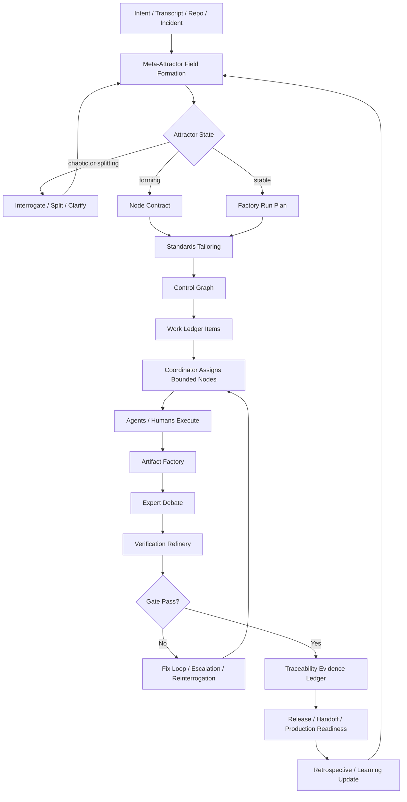

# 11. Best-Of-All Merged Control Plane

Status: merged design proposal.

Date: 2026-04-24.

Purpose: merge the strongest ideas from the inspiration systems into DFMS without copying their products, terminology, or vendor assumptions.

## Synthesis Verdict

The best system is not one of the examples alone. The best system is:

- DFMS for requirements, standards, artifact governance, traceability, expert review, human-agent handoff, and production ownership.
- StrongDM Attractor for NLSpec-first implementability and graph/pipeline discipline.
- Fabro for executable workflow graphs, model routing, checkpoints, verification, sandboxes, API/UI, and retrospectives.
- Gas Town for durable multi-agent work state, coordinator/worker model, health monitoring, escalation, merge refinery, and predecessor recovery.
- Octopus Garden AI for business-facing discovery, rollout, training, and support posture.
- Fabriqa.ai for PRD-to-code traceability and validation-layer framing.
- Factory.ai for delegation surfaces and agent-native task intake from where humans already work.
- Octopus Deploy for deployment, audit, troubleshooting, remediation, and operations lifecycle discipline.

DFMS remains the control plane. The others become optional implementation patterns or adapters.

## Merged Architecture Layers

| Layer | Adopted From | DFMS Meaning |
| --- | --- | --- |
| Requirement field | DFMS, Octopus Garden AI | Customer discovery, transcript digestion, ambiguity collapse, approval state |
| NLSpec layer | StrongDM Attractor | Human-readable specs strong enough for agents to implement and validate |
| Control graph | Attractor, Fabro, DFMS | Lifecycle nodes, child skills, gates, evidence outputs, human decisions |
| Workflow runtime | Fabro, Attractor | Optional executable graph runner for repeatable project flows |
| Work ledger | Gas Town, Fabriqa | Durable records for requirements, beads/tasks, artifacts, evidence, decisions |
| Coordinator/worker layer | Gas Town, Factory.ai | Central coordinator assigns bounded work to agents or humans |
| Verification refinery | DFMS, Fabro, Gas Town | Tests, reviews, rubric scores, trace completeness, merge/readiness gates |
| Deployment/operations layer | Octopus Deploy, DFMS | Release, rollback, observability, incident, remediation, maintenance |
| Adoption/support layer | Octopus Garden AI | Training, support, rollout, business process fit |
| Learning loop | Fabro, Gas Town, DFMS | Retrospectives update rubrics, templates, skills, gates, and transfer tests |

## Best-Of-All Control Graph

This graph is a neutral DFMS control graph. It is not a commitment to any specific DOT engine, CLI, dashboard, or cloud runtime.

## Merged Requirements

### Meta-Attractor Requirements

| ID | Requirement | Source Inspiration | Verification |
| --- | --- | --- | --- |
| REQ-META-001 | Convert raw intent into an attractor state before execution. | DFMS | Attractor record exists |
| REQ-META-002 | Separate product-specific, factory-evaluation, and reusable-factory requirements. | DFMS | Field map review |
| REQ-META-003 | Produce a node contract for every material lifecycle node. | DFMS, Attractor | Node contract completeness check |
| REQ-META-004 | Generate or update a control graph for complex runs. | Attractor, Fabro | Graph lint/review |
| REQ-META-005 | Maintain a standards-tailoring decision before artifact expansion. | DFMS | Governance certificate |

### Workflow Runtime Requirements

| ID | Requirement | Source Inspiration | Verification |
| --- | --- | --- | --- |
| REQ-WF-001 | Represent repeatable work as versioned graph or ordered node definitions. | Attractor, Fabro | Graph/artifact diff review |
| REQ-WF-002 | Support human gates for approval, revision, steering, and takeover. | Attractor, Fabro, DFMS | Handoff replay test |
| REQ-WF-003 | Support model, expert, or skill routing by node type and risk. | Fabro, DFMS | Routing record |
| REQ-WF-004 | Support checkpoints and resume points at phase gates. | Fabro, Gas Town | Recovery drill |
| REQ-WF-005 | Keep runtime optional so DFMS can work as Codex skills first. | DFMS | Tailoring record |

### Work Ledger Requirements

| ID | Requirement | Source Inspiration | Verification |
| --- | --- | --- | --- |
| REQ-LEDGER-001 | Store durable work items for requirements, artifacts, risks, decisions, tests, and handoffs. | Gas Town, Fabriqa, DFMS | Ledger schema review |
| REQ-LEDGER-002 | Link every work item to source, owner, status, evidence, and next action. | Gas Town, DFMS | Traceability check |
| REQ-LEDGER-003 | Provide predecessor recovery for long-running sessions. | Gas Town, DFMS | Fresh-session replay |
| REQ-LEDGER-004 | Record escalations as trackable work, not hidden chat context. | Gas Town | Escalation record |

### Verification Refinery Requirements

| ID | Requirement | Source Inspiration | Verification |
| --- | --- | --- | --- |
| REQ-REFINERY-001 | Treat tests, builds, security checks, traceability, and rubric review as gates. | DFMS, Fabro, Gas Town | Quality certificate |
| REQ-REFINERY-002 | Failed gates trigger fix loops, reinterrogation, or escalation. | Fabro, DFMS | Failure loop evidence |
| REQ-REFINERY-003 | Merge or acceptance cannot occur without evidence and residual-risk state. | DFMS, Gas Town | Acceptance certificate |
| REQ-REFINERY-004 | Holdout scenarios and transfer tests prevent benchmark gaming. | DFMS | Holdout report |

### Production And Adoption Requirements

| ID | Requirement | Source Inspiration | Verification |
| --- | --- | --- | --- |
| REQ-OPS-001 | Release packages must include deployment, rollback, observability, incident, and owner artifacts. | DFMS, Octopus Deploy | Production readiness review |
| REQ-OPS-002 | Operational troubleshooting and remediation paths must be documented. | Octopus Deploy | Runbook drill |
| REQ-OPS-003 | Human training and support handoff must exist where humans own the system. | Octopus Garden AI, DFMS | Handoff replay |
| REQ-OPS-004 | Customer rollout impact must be captured for business-facing automations. | Octopus Garden AI | Adoption checklist |

### Interface And Delegation Requirements

| ID | Requirement | Source Inspiration | Verification |
| --- | --- | --- | --- |
| REQ-IFACE-001 | DFMS should be invokable from Codex skills first. | DFMS | Skill validation |
| REQ-IFACE-002 | Future adapters may expose IDE, CLI, web, issue tracker, chat, or API entry points. | Factory.ai, Fabro, Gas Town | Adapter design review |
| REQ-IFACE-003 | Interface convenience must not bypass governance gates. | DFMS | Gate bypass test |

## Best-Of-All Operating Modes

| Mode | Description | Best Inspiration |
| --- | --- | --- |
| Skill-native mode | Codex skills produce artifacts, decisions, reviews, and handoff packages | DFMS |
| Graph-runtime mode | Control graph runs through a workflow engine | Attractor, Fabro |
| Multi-agent workspace mode | Coordinator distributes ledger items to workers and monitors health | Gas Town |
| Trace-to-code mode | Requirements and PRD sections map to implementation and validation | Fabriqa |
| Delegation-surface mode | Work can enter from IDE, CLI, web, issue tracker, or chat | Factory.ai |
| Production-handoff mode | Release, deployment, incident, remediation, and audit artifacts are first-class | Octopus Deploy |
| Business-rollout mode | Discovery, training, deployment, support, and adoption are first-class | Octopus Garden AI |

## What Changes In DFMS

### Add

- `DFMS Control Graph` as a first-class artifact.
- `Work Ledger` as a first-class evidence and coordination artifact.
- `Refinery Gate` as the acceptance gate that joins rubric review, tests, traceability, and residual risk.
- `Runtime Adapter` as an optional later layer.
- `Retrospective Learning Record` after every significant run.
- `Adapter Boundary` to prevent vendor-specific lock-in.

### Keep

- Standards-first SDLC.
- Customer interrogation before implementation.
- Expert debate and 15-point rubrics.
- Bidirectional traceability.
- Human-agent handoff.
- Production and maintenance handoff.
- Anti-overfit transfer testing.

### Avoid

- Copying external terminology into user-facing artifacts when it adds confusion.
- Requiring cloud sandboxes for every run.
- Treating a graph runtime as mandatory before the skill system works.
- Replacing standards artifacts with workflow logs.
- Letting dashboards or delegation interfaces bypass approval gates.

## Best-Of-All Quality Gate

A DFMS run may claim "best-of-all merged process" only if it has:

1. Requirement field map.
2. Standards tailoring matrix.
3. Control graph or ordered lifecycle nodes.
4. Work ledger entries for material work.
5. Expert debate record.
6. 15-point rubric scorecards.
7. Bidirectional traceability.
8. Verification evidence.
9. Refinery acceptance or rework record.
10. Handoff record.
11. Production/adoption record when applicable.
12. Retrospective learning update.

## Implementation Roadmap

### Phase A: Spec Merge

- Add this merged control-plane artifact.
- Update README and manifest.
- Keep DFMS Codex-skill-native.

### Phase B: Control Graph Template

- Create a reusable control graph template for greenfield, brownfield, artifact-only, and production-handoff runs.
- Add graph lint checks.

### Phase C: Work Ledger Schema

- Create a neutral ledger schema for requirements, tasks, artifacts, tests, risks, decisions, handoffs, and evidence.
- Map ledger records to project-book artifacts.

### Phase D: Refinery Gate

- Merge tests, traceability, expert rubrics, and residual-risk acceptance into one explicit gate.
- Add certificate templates.

### Phase E: Runtime Adapter

- Optional adapters to Fabro-like graph runners, Gas Town-like workspaces, issue trackers, CI/CD, or deployment tools.
- Keep adapter boundaries explicit.

### Phase F: Dashboard / Human Surface

- Present run state, gates, risks, and decisions in a human-readable surface.
- Do not expose internal noise unless needed for audit.

## Acceptance

This merge is accepted as a DFMS design direction if:

- It strengthens the user's requirements rather than replacing them.
- It keeps DFMS usable today as Codex skills.
- It leaves room for executable runtime adapters later.
- It preserves standards, traceability, evidence, and human ownership as the spine.
