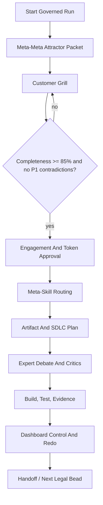

# Dark Factory Control Console UI Record

**NO AI SLOP ALLOWED AT ALL - ZERO TOLERANCE TO SLOP AND HALLUCINATIONS**

Strict compliance is mandatory. Every UI, invocation, progress, interrogation, dashboard, and validation claim below must be backed by the files and command evidence listed here.

## Trigger

The user asked for a user interface that invokes the meta-meta skills first, then meta-skills, shows progress, and grills the user for requirements before execution.

## Product Boundary

This pass builds a local control console, not a hosted multi-user SaaS.

The console is intentionally a control surface for Codex-mediated skill execution:

- It creates governed invocation packets.
- It persists run ledgers under `dark-factory-control-console/runs`.
- It enforces meta-meta-first sequencing.
- It blocks locked child stages.
- It scores customer interrogation completeness and contradictions.
- It exposes local skill metadata from `codex-skills`.
- It reads the dashboard-control graph from the todo/habits project book.
- It computes selected-node redo closure through the dashboard-control endpoint.

Codex skills are instruction bundles, not browser-callable functions. The UI therefore records the packet and gate state that a Codex run should consume. Executable DFMS tools are called where possible; when sandbox policy blocks Node child process launch, the server uses its JavaScript dashboard-closure fallback against the existing dashboard index and records that fallback mode.

## Implemented Files

| File | Purpose |
| --- | --- |
| `dark-factory-control-console/package.json` | Local scripts for server and tests |
| `dark-factory-control-console/server.js` | Zero-dependency API server, skill loader, run ledger, gates, redo endpoint |
| `dark-factory-control-console/public/index.html` | Material-style operational UI |
| `dark-factory-control-console/public/styles.css` | Material 3-inspired tokens and responsive layout |
| `dark-factory-control-console/public/app.js` | Run creation, interrogation capture, stage invocation, redo closure UI |
| `dark-factory-control-console/tests/control-console.test.cjs` | API and gate unit test |
| `dark-factory-control-console/tests/browser-console.test.cjs` | Browser smoke test |
| `dark-factory-control-console/README.md` | Usage and boundary notes |

## UI Flow

## Customer Grill

The UI captures answer IDs for:

- business outcome;
- primary users;
- product surfaces;
- domain rules;
- quality bar;
- testing proof;
- data and privacy;
- non-goals;
- token boundary;
- approval owner;
- inspiration-versus-binding inputs;
- brownfield context.

The current scoring blocks casual test waivers, UI work without browser/visual proof, and production/security/privacy language without an approval owner.

## Validation Evidence

| Check | Result | Evidence |
| --- | --- | --- |
| Server syntax | pass | `node -c server.js` |
| Unit/API gate test | pass | `npm test` |
| Redo endpoint fallback | pass | `computeRedoClosure({ node: "02-prd.md" })` returned 9 impacted nodes and 2 dashboard outputs |
| Browser smoke test | pass | `npm run test:browser` outside sandbox |
| Local server | pass | `http://127.0.0.1:4187/api/bootstrap` returned zero-slop policy |

Browser screenshot evidence:

`dark-factory-control-console/artifacts/browser-console-smoke.png`

Mobile screenshot evidence:

`dark-factory-control-console/artifacts/browser-console-mobile-smoke.png`

## Expert Critic Panel

| Expert | Role Persona | Verdict |
| --- | --- | --- |
| Control Console Product Architect | Designs operational tools for delivery governance, client checkpoints, and project control. Rejects dashboards that are only decorative. | Pass for local control console. It creates real run packets, ledgers, gates, interrogation scoring, and redo closure. |
| Requirements Interrogation Lead | Owns customer grilling, answer IDs, contradiction checks, and recursive spec readiness. Rejects checklist-only intake. | Conditional pass. The UI includes answer IDs, required scoring, and contradiction blockers. Future pass should add branch-specific follow-up question generation. |
| Workflow Assurance Auditor | Owns no-skip sequencing, active-stage locking, progress gates, and next legal action discipline. Rejects direct child-skill starts. | Pass for current boundary. Runs begin at `df-meta-attractor`, and child stages remain locked until gates advance. |

## Residual Risks

- The UI records Codex invocation packets but does not directly execute instruction-only skills; Codex still mediates actual skill use.
- The server fallback computes redo closure from an existing dashboard index when Node cannot spawn Python in a sandbox. Formal certification should rebuild the index with the canonical Python script before closure.
- This is local single-user infrastructure. Multi-user auth, hosted review, permissions, and audit trails are future scope.

## Certification State

Conditional pass for local DFMS control-console readiness.

The UI is real and validated, but full enterprise portal certification requires hosted identity, permissioned reviewer roles, persistent database storage, and explicit integration with a Codex skill-execution runtime.
