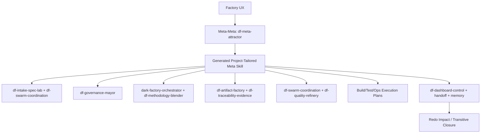

# Factory Execution UX Record

**NO AI SLOP ALLOWED AT ALL - ZERO TOLERANCE TO SLOP AND HALLUCINATIONS**

Strict compliance is mandatory. Every statement about initiation, execution, project collection, skill hierarchy, generated records, and validation below must be backed by the files and command evidence listed here.

## Trigger

The user clarified that the factory UX must initiate meta-skills from the meta-meta skill, initiate concrete skills from the generated meta-skill, execute skills, collect all project information, and execute the project workflow.

## Implemented Upgrade

The control console now has a real execution cockpit, not only an invocation-packet viewer.

Added behavior:

- `df-meta-attractor` execution writes meta-attractor, product-tailoring, and generated-meta-skill records.
- The generated meta-skill contract names product type, surfaces, selected meta-skills, required sequence, and refusal rules.
- The customer grill produces an intake package and recursive spec decomposition record.
- Engagement/token approval produces governance and token-budget records.
- Meta-skill routing produces routing, lifecycle control graph, and execution-kernel next-action records.
- Artifact planning produces artifact BOM, traceability seed, starter project-book index, run summary Markdown, and initial PRD skeleton.
- Expert stages produce expert panel, critic panel, and quality-refinery gate records.
- Build/test stages produce implementation, test evidence, and production/SRE handoff plans.
- Dashboard/handoff stages produce dashboard-control, human-agent handoff, context-memory records, and redo impact report.
- The UI has an `Execute Ready Pipeline` action that runs legal stages until it hits a blocker or reaches handoff readiness.
- The UI shows collection status, generated meta-skill JSON, current stage, and execution records.

## Execution Hierarchy

## Concrete Records Created Per Run

Records are written under `dark-factory-control-console/runs/<run-id>/records`.

| Stage | Records |
| --- | --- |
| Meta-meta | `meta-attractor-run-record.json`, `product-tailoring-profile.json`, `generated-meta-skill-contract.json` |
| Interrogation | `intake-package.json`, `recursive-spec-decomposition-record.json` |
| Engagement | `engagement-governance-record.json`, `token-budget-record.json` |
| Routing | `skill-routing-record.json`, `lifecycle-control-graph.json`, `execution-kernel-next-action.json` |
| Artifacts | `artifact-bom.json`, `traceability-seed.json`, `starter-project-book-index.json`, starter project-book Markdown |
| Experts | `expert-panel-record.json`, `critic-panel-record.json`, `quality-refinery-gate.json` |
| Build/Test | `implementation-execution-plan.json`, `test-evidence-plan.json`, `production-sre-handoff-plan.json` |
| Dashboard/Handoff | `dashboard-control-record.json`, `human-agent-handoff-record.json`, `context-memory-pack.json`, redo impact report |

## UI Evidence

Files updated:

- `dark-factory-control-console/server.js`
- `dark-factory-control-console/public/index.html`
- `dark-factory-control-console/public/app.js`
- `dark-factory-control-console/public/styles.css`
- `dark-factory-control-console/tests/control-console.test.cjs`
- `dark-factory-control-console/tests/browser-console.test.cjs`

Validation evidence:

| Check | Result |
| --- | --- |
| `node -c server.js` | pass |
| `npm test` | pass |
| `npm run test:browser` | pass |
| `/api/bootstrap` live check | pass |

## Expert Critic Panel

| Expert | Role Persona | Finding | Verdict |
| --- | --- | --- | --- |
| Factory UX Architect | Owns end-to-end human control surfaces for complex delivery factories. Rejects UIs that are just forms. | The console now has stage execution, generated meta-skill display, records, project collection, and redo closure. | Pass for local console scope. |
| Meta-Meta Governance Auditor | Owns the rule that governed work starts with meta-meta, then generated meta-skill, then child skills. Rejects direct child-skill starts. | Stage locking and `Execute Ready Pipeline` preserve the hierarchy and write records in order. | Pass. |
| Project Execution Evidence Critic | Owns proof that "execute" creates durable artifacts, not only screen state. Rejects fake execution. | Per-stage JSON/Markdown records are materialized under run folders; tests assert record creation. | Conditional pass: actual code generation/deployment still requires a project-specific execution bead. |

## Remaining Boundary

The console executes the DFMS control records and starter project book. It does not yet autonomously modify arbitrary product source code, run arbitrary repo-specific test suites, or deploy production. Those actions must be launched by a project-specific generated meta-skill stage with explicit approval, repository path, command policy, evidence targets, and rollback/handoff records.
