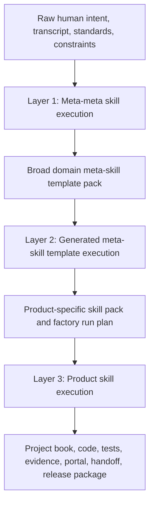

**NO AI SLOP ALLOWED AT ALL - ZERO TOLERANCE TO SLOP AND HALLUCINATIONS**

# Document Generation Layer Map

## Purpose

This document explains what is generated at each layer of the dark-factory system:

1. Meta-meta skill execution.
2. Generated meta-skill template execution.
3. Product-specific skill execution.

The distinction matters. A meta-meta skill does not directly build the product. It designs and governs a broad factory template for a class of software projects. A generated meta-skill does not directly ship the product either. It tailors that factory template into a product-specific delivery system. The product-specific skills then generate the project documents, code, tests, evidence, dashboards, handoff materials, and release artifacts.

## Three-Layer Model

## Layer 1: Meta-Meta Skill Execution

### What This Layer Is

The meta-meta skill is the factory designer. It takes a broad software delivery domain and creates reusable meta-skill templates for that domain.

Examples of broad domains:

- Consumer productivity applications.
- Enterprise workflow systems.
- Regulated healthcare software.
- Financial operations platforms.
- Developer tools.
- Internal data platforms.
- AI-assisted knowledge work systems.

This layer answers: "What kind of factory should exist for this class of software projects?"

### What This Layer Must Not Claim

The meta-meta layer must not claim that the product is built, tested, compliant, or ready for handoff. It can only claim that a reusable factory template has been designed, governed, reviewed, and validated.

### Documents And Artifacts Generated By Meta-Meta Execution

| Artifact | Purpose | Form |
| --- | --- | --- |
| Meta-Meta Attractor Run Record | Captures raw intent, attractor state, scope boundaries, tensions, assumptions, risks, and selected operating mode. | JSON or Markdown record |
| Broad Domain Factory Charter | Defines the broad SDLC domain the factory serves and what product types are in or out of scope. | Markdown |
| Domain Capability Map | Lists domain capabilities, common workflows, quality concerns, user types, data types, and integration patterns. | Markdown plus graph |
| Standards Tailoring Framework | Defines which standards and methods are available for tailoring, such as ISO 12207, ISO 15289, RUP, MDA, DDD, TDD, BDD, SRE, SSDF, OWASP, accessibility, privacy, and product-specific standards. | Markdown plus matrix |
| Domain Lifecycle Metamodel | Defines the allowed lifecycle nodes, stage gates, predecessor rules, re-entry paths, and no-skip constraints for this class of projects. | Mermaid, JSON, YAML |
| Meta-Skill Template Catalog | Defines which meta-skill templates can be instantiated for projects in the domain. | Manifest YAML |
| Broad Artifact BOM Template | Defines the universe of artifact types that projects in this domain may need. | Markdown and JSON |
| Artifact Tailoring Rules | Defines when artifacts are mandatory, optional, waived, expanded, or collapsed based on risk, size, surface area, and lifecycle. | Markdown |
| Expert Role Taxonomy | Defines elite domain role personas that can be assigned to future projects. | Markdown and JSON |
| Critic Panel Taxonomy | Defines adversarial critic roles and how they are attached to artifact families. | Markdown and JSON |
| Interrogation Protocol Template | Defines how customer questioning, answer IDs, contradiction scoring, completeness scoring, re-interrogation, and approval work. | Markdown and JSON |
| Recursive Spec Decomposition Template | Defines how broad intent is decomposed into branches, sub-branches, scenarios, NFRs, risks, tests, and open questions. | Markdown and graph |
| Token Budget Governance Template | Defines token SWAG bands, approval checkpoints, reapproval triggers, and change-control mechanics. | Markdown and JSON |
| Control Graph Template | Defines control nodes, dependencies, gates, allowed transitions, and blocked states. | YAML or JSON |
| Work Ledger Template | Defines task beads, owners, states, evidence, next actions, blockers, and closure rules. | Markdown and JSON |
| PERT and Critical Path Template | Defines dependency planning, critical path calculation, ready nodes, and re-entry dependencies. | JSON and Mermaid |
| Knowledge Graph Schema | Defines typed nodes and edges for intent, answers, requirements, artifacts, code, tests, reviewers, evidence, risks, gates, handoffs, and lessons. | JSON schema |
| Refinery Gate Template | Defines artifact and code acceptance gates, review thresholds, RALPH loop requirements, and failed-point fix evidence. | YAML or JSON |
| Quality Rubric Library Template | Defines 15-plus-point rubric structures for artifact families and specialist reviews. | Markdown and JSON |
| Generated Meta-Skill Contract Template | Defines the contract that a future product-specific meta-skill must satisfy. | JSON |
| Product Tailoring Profile Template | Defines what information is required before creating a product-specific factory. | JSON |
| Human Review Portal Template | Defines the required documentation dashboard, reading paths, diagrams, evidence index, decision log, and redo controls. | HTML/JSON/Markdown |
| Dashboard-Control Template | Defines graph indexing, selected-node redo requests, transitive downstream impact, reopened gates, and rerun tests. | JSON and HTML |
| Handoff Template | Defines human-agent takeover, handback, async review, confidence framing, and re-verification triggers. | Markdown and JSON |
| Production Handoff Template | Defines release, rollback, observability, incident, runbook, outage drill, and operator-readiness expectations. | Markdown and JSON |
| Meta-Skill Bundle Manifest | Lists generated meta-skill templates and their dependency order. | YAML |
| Meta-Meta Quality Certificate | Certifies that the broad factory template passed review, validators, and residual-risk disclosure. | Markdown and JSON |

### Output Shape

The result of this layer is a broad domain meta-skill template pack. It is reusable across many products in the same SDLC domain. It is not yet tailored to one product.

## Layer 2: Generated Meta-Skill Template Execution

### What This Layer Is

The generated meta-skill template is the product factory compiler. It takes a specific product request and creates a product-specific skill pack and factory run plan.

This layer answers: "Given this product, which exact skills, experts, artifacts, gates, tests, and workflow steps must be instantiated?"

### What This Layer Must Not Claim

The generated meta-skill layer must not claim that the final product has been implemented or tested. It can only claim that the product-specific delivery system is ready to execute.

### Documents And Artifacts Generated By Meta-Skill Template Execution

| Artifact | Purpose | Form |
| --- | --- | --- |
| Product Tailoring Profile | Captures product category, surfaces, risks, quality bar, users, data, integrations, domain rules, and lifecycle flags. | JSON |
| Generated Product Meta-Skill Charter | Defines the product-specific factory behavior, required skills, forbidden shortcuts, and quality bar. | Markdown |
| Product-Specific Skill Manifest | Lists the product-specific skills to execute, their order, dependencies, and stage gates. | YAML |
| Factory Instantiation Record | Proves the broad meta-meta template was instantiated into a product-specific factory. | JSON |
| Customer Interrogation Packet | Contains required questions, answer IDs, contradiction checks, completeness scoring, re-interrogation triggers, and approval mechanics. | Markdown and JSON |
| Product Recursive Decomposition Tree | Breaks the product into domains, capabilities, scenarios, NFRs, risks, tests, and artifact obligations. | Markdown and graph |
| Product Standards Tailoring Matrix | Selects the standards and methods that apply to this product and explains waivers. | Markdown and JSON |
| Product SDLC Stage Coverage Matrix | Defines required, optional, waived, and not-applicable SDLC stages for this product. | JSON |
| Product Artifact BOM | Lists the product documents, records, evidence files, code artifacts, tests, dashboards, and release materials to generate. | Markdown and JSON |
| Product Expert Panel Roster | Assigns elite expert roles for product decisions, architecture, UX, domain, security, testing, SRE, and governance. | Markdown and JSON |
| Product Critic Panel Roster | Assigns adversarial critics for each major artifact and stage. | Markdown and JSON |
| Product Review Rubric Set | Selects artifact-level 15-plus-point rubrics and pass thresholds. | JSON |
| Product Control Graph | Defines product-specific lifecycle nodes and allowed transitions. | JSON or YAML |
| Product Work Ledger | Creates product task beads, owners, states, evidence obligations, and next legal actions. | Markdown and JSON |
| Product PERT Plan | Defines dependencies, critical path, blocked nodes, and re-entry logic. | JSON and Mermaid |
| Product Knowledge Graph Seed | Creates initial trace nodes for intent, questions, requirements, risks, artifacts, tests, and handoff. | JSON |
| Token Budget And Engagement Record | Captures rough token SWAG, client approval state, iteration boundary, and reapproval triggers. | JSON |
| Quality Refinery Plan | Defines review rounds, RALPH loops, score thresholds, fix loops, certificates, and evidence. | Markdown and JSON |
| Test Architecture Plan | Defines required unit, integration, scenario, holdout, transfer, browser/WYSIWYG, accessibility, security, performance, and operations tests. | Markdown |
| Dashboard And Redo Plan | Defines how all artifacts will be indexed and how a selected node triggers downstream redo. | Markdown and JSON |
| Human Review Portal Plan | Defines reviewer onboarding, role-based reading paths, decision points, and evidence dashboard. | Markdown and JSON |
| Production Readiness Plan | Defines release, rollback, observability, runbooks, incident drills, and operator handoff expected later. | Markdown |
| Product Factory Readiness Certificate | Certifies that the product-specific factory is ready for skill execution. | Markdown and JSON |

### Output Shape

The result of this layer is a product-specific skill pack and run plan. It knows what to execute, in what order, with which experts, artifacts, tests, gates, and human checkpoints.

## Layer 3: Product-Specific Skill Execution

### What This Layer Is

The product-specific skills are the actual delivery engine. They generate the project book, perform design and implementation, run tests, produce evidence, conduct reviews, update dashboards, and prepare handoff.

This layer answers: "What did we build, why, how was it verified, who reviewed it, what remains risky, and how can a human continue safely?"

### Documents And Artifacts Generated By Product Skill Execution

#### Intake And Requirements

| Artifact | Purpose |
| --- | --- |
| Factory Run Summary | Summarizes the product run, scope, stages, status, and evidence. |
| Customer Interrogation Record | Stores questions, answers, answer IDs, contradiction checks, completeness scoring, and approvals. |
| Business Requirements Document | Captures business outcomes, stakeholders, value, constraints, and success measures. |
| Product Requirements Document | Captures product vision, users, features, workflows, acceptance criteria, non-goals, and release scope. |
| Software Requirements Specification | Captures precise functional requirements, interfaces, constraints, and verification methods. |
| NFR Catalog | Captures performance, reliability, security, privacy, accessibility, usability, maintainability, and operability requirements. |
| Assumption And Decision Log | Separates facts, assumptions, choices, approvals, and unresolved questions. |
| Persona And Journey Map | Describes users, motivations, contexts, workflows, and pain points. |
| Scenario Catalog | Defines happy paths, edge cases, failure paths, holdout cases, and transfer cases. |
| Acceptance Criteria Catalog | Defines measurable pass/fail criteria for each requirement and scenario. |
| Glossary And Ubiquitous Language | Defines domain vocabulary for users, engineers, reviewers, and operators. |

#### Governance And Planning

| Artifact | Purpose |
| --- | --- |
| Project Charter | Defines mission, scope, owners, authority, budget posture, and delivery model. |
| Engagement Governance Record | Defines client/dark-factory checkpoints, approval rights, token SWAG, and change-control rules. |
| RASCI Matrix | Defines responsible, accountable, supporting, consulted, and informed roles. |
| Standards Tailoring Record | Documents selected standards, methods, controls, and waivers. |
| Change Control Plan | Defines how scope, design, requirements, token budget, and schedule changes are proposed and approved. |
| Risk Register | Captures risks, likelihood, impact, mitigation, owner, status, and review cadence. |
| Issue Log | Tracks active delivery blockers and resolutions. |
| Decision Records | Captures architecture, product, UX, security, data, testing, and operations decisions. |
| Work Ledger And Task Beads | Tracks exact work nodes, gate states, evidence, next actions, and closure rationale. |
| PERT And Critical Path Plan | Tracks dependencies and prevents skipped steps. |
| Knowledge Graph | Links intent, requirements, artifacts, decisions, code, tests, reviewers, evidence, and gates. |

#### Product Design And Architecture

| Artifact | Purpose |
| --- | --- |
| Competitive Benchmark Research | Documents relevant product patterns and differentiators. |
| UX Strategy | Defines product experience principles, information architecture, interaction model, and accessibility posture. |
| Design System Conformance Record | Maps UI implementation to the selected design standard, such as Material. |
| Wireframes Or Screen Inventory | Lists screens, components, states, empty states, error states, and responsive behavior. |
| User Flow Diagrams | Shows user paths across features and edge cases. |
| System Context Diagram | Shows users, external systems, data flows, and boundaries. |
| Container And Component Architecture | Shows runtime containers, modules, services, dependencies, and ownership. |
| High-Level Design | Explains major architecture choices and system decomposition. |
| Low-Level Design | Specifies implementation-level modules, algorithms, data contracts, and control flow. |
| Domain Model | Defines entities, value objects, aggregates, policies, invariants, and domain events. |
| DDD Bounded Context Map | Defines context boundaries, upstream/downstream relationships, and integration styles. |
| Data Model | Defines storage entities, relationships, indexes, migrations, and retention. |
| API Specification | Defines endpoints, schemas, errors, authentication, authorization, and versioning. |
| MDA CIM/PIM/PSM Records | Captures computation-independent, platform-independent, and platform-specific transformations. |
| Threat Model | Captures assets, trust boundaries, abuse cases, mitigations, and residual security risk. |
| Privacy Impact Record | Captures personal data, purpose, retention, access, consent, and deletion rules. |

#### Implementation And Engineering

| Artifact | Purpose |
| --- | --- |
| Implementation Plan | Defines build sequence, ownership, dependencies, and acceptance gates. |
| Source Code | Implements the product. |
| Configuration And Environment Guide | Defines local, test, staging, and production configuration. |
| Dependency Inventory | Lists dependencies, versions, purpose, licenses, and risk notes. |
| Build And CI Record | Defines build commands, checks, CI gates, and failure handling. |
| Coding Standards Record | Defines language/framework conventions and review expectations. |
| Migration Plan | Defines schema/data migrations and rollback steps when needed. |
| Implementation Execution Record | Proves that implementation work happened and links it to requirements and tests. |

#### Verification And Quality

| Artifact | Purpose |
| --- | --- |
| Test Strategy | Defines test levels, responsibilities, coverage goals, environments, and exit criteria. |
| TDD/BDD Scenario Set | Defines executable behavior scenarios before or during implementation. |
| Test Case Catalog | Lists unit, integration, end-to-end, UI, accessibility, performance, security, and operations tests. |
| Test Data Plan | Defines generated, anonymized, seeded, and edge-case data. |
| Unit Test Evidence | Shows core logic verification. |
| Integration Test Evidence | Shows module/service integration verification. |
| End-To-End Test Evidence | Shows whole workflow verification. |
| Scenario Test Matrix | Links scenarios to requirements and evidence. |
| Holdout And Transfer Test Evidence | Shows the product works beyond the examples used during design. |
| Browser/WYSIWYG Test Record | Shows rendered UI behavior, layout, and interaction verification. |
| Accessibility Audit | Verifies keyboard, semantics, contrast, labels, focus, and screen-reader behavior. |
| Static UI Audit | Verifies DOM, design-system constraints, text fit, and layout rules. |
| Performance Test Record | Verifies speed, load, and resource targets when applicable. |
| Security Test Record | Verifies security controls and known-risk handling when applicable. |
| Defect Register | Tracks defects, severity, owner, fix, verification, and closure. |
| Quality Refinery Gate | Records expert review, rubric scores, failed points, fixes, and acceptance decision. |
| Quality Certificate | Certifies accepted scope, evidence, residual risks, and revalidation triggers. |

#### Release, Operations, And Handoff

| Artifact | Purpose |
| --- | --- |
| Release Plan | Defines release scope, approvals, readiness, and rollback window. |
| Deployment Guide | Defines deployment steps and required checks. |
| Rollback Plan | Defines rollback criteria, commands, data concerns, and owner. |
| Observability Plan | Defines logs, metrics, traces, dashboards, alerts, and health checks. |
| Runbook | Defines operating procedures, common failures, diagnosis, and recovery. |
| Incident Response Guide | Defines severity levels, escalation, communication, and post-incident review. |
| Outage Drill Record | Proves humans or operators can debug and recover from realistic failures. |
| Operator Readiness Signoff | Confirms production owners understand how to run the system. |
| Maintenance Plan | Defines patching, dependency updates, monitoring, and future enhancement flow. |
| Human-Agent Handoff Record | Packages state so a human or future agent can safely resume. |
| Retrospective Learning Record | Captures lessons, recurring defects, process updates, and future skill improvements. |
| Human Review Portal | Organizes all documents, records, diagrams, evidence, decisions, and next actions for reviewers. |
| Dashboard-Control Index | Provides graph view, impact closure, redo request support, and downstream revalidation planning. |

## Layer Responsibility Matrix

| Question | Meta-Meta Skill Execution | Meta-Skill Template Execution | Product Skill Execution |
| --- | --- | --- | --- |
| What is being generated? | Broad domain factory templates. | Product-specific factory and skill pack. | Actual project documents, code, tests, evidence, and handoff. |
| Main unit of design | SDLC domain. | Product. | Feature, artifact, code, test, release item. |
| Main output | Reusable meta-skill template pack. | Tailored product factory run plan. | Project book and delivered product. |
| Scope of experts | Domain-level expert taxonomy. | Product-specific expert panel. | Artifact and implementation reviewers. |
| Scope of rubrics | Artifact-family and stage-family rubrics. | Product-selected rubrics and thresholds. | Concrete scored reviews and certificates. |
| Scope of tests | Required test classes by project type. | Product-specific test architecture. | Actual test files, test runs, screenshots, and evidence. |
| Scope of traceability | Schema and mandatory link rules. | Product trace seed and graph plan. | Fully populated bidirectional trace links. |
| Completion claim allowed | Domain factory template is ready. | Product factory is ready to execute. | Product scope is built, tested, reviewed, and handed off. |

## Todo Plus Habits App Trace-Through

The todo plus habits app is a demonstrator product. It should not overfit the entire DFMS system, but it is useful because a reviewer can understand the product quickly and see whether the dark-factory workflow actually produces concrete documents, code, tests, and evidence.

### Layer 1 For This Demonstrator

For the todo plus habits demonstrator, the meta-meta layer would create a broad factory template such as:

**Consumer Productivity App Dark-Factory Template Pack**

Likely generated meta-meta artifacts:

- Consumer productivity domain factory charter.
- Consumer productivity capability map.
- Lightweight data/privacy standards tailoring framework.
- Material UI and accessibility design-system template.
- Personal productivity scenario taxonomy.
- Behavior and habit-loop test template.
- Offline/local-first risk template, if local persistence is in scope.
- UX critic taxonomy for daily-use habit products.
- Retention, notification, streak, and behavioral-safety review prompts.
- Product factory meta-skill template manifest.

This layer does not decide the exact task model, habit cadence, streak rules, or UI. It creates the reusable factory frame for products of this kind.

### Layer 2 For This Demonstrator

Executing the generated consumer-productivity meta-skill for this specific product would create:

**Northstar Daily Product Factory**

Likely generated meta-skill execution artifacts:

- `product-tailoring-profile.json`
- `generated-meta-skill-contract.json`
- `dark-factory-instantiation-record.json`
- product-specific interrogation record
- recursive spec decomposition record
- product artifact BOM
- product expert panel and critic panel
- product SDLC stage coverage matrix
- product control graph
- product work ledger
- product PERT plan
- product knowledge graph seed
- token and engagement governance record
- test architecture for tasks, habits, streaks, focus, accessibility, and WYSIWYG browser behavior
- dashboard and redo plan
- human review portal plan

This layer decides that the product will need requirements, UI/UX, data model, behavior tests, accessibility checks, browser checks, traceability, dashboard-control, quality certificates, and handoff records.

### Layer 3 For This Demonstrator

Executing the product-specific skills generated the project book, app files, tests, and evidence.

Existing project-book Markdown artifacts include:

| Artifact | File |
| --- | --- |
| Factory run summary | `00-factory-run-summary.md` |
| Research and competitive benchmark | `01-research-competitive-benchmark.md` |
| Product requirements document | `02-prd.md` |
| Architecture | `03-architecture.md` |
| Test strategy | `04-test-strategy.md` |
| Traceability matrix | `05-traceability-matrix.md` |
| Expert review and RALPH record | `06-expert-review-and-ralph.md` |
| Handoff and runbook | `07-handoff-and-runbook.md` |
| Hawkeye blocker and change record | `08-hawkeye-blocker-and-change-record.md` |
| Iteration 2 hardening record | `09-iteration-2-hardening-record.md` |
| RALPH 20 E2E completeness record | `10-ralph-20-e2e-completeness-record.md` |
| Standards/meta-meta charter audit | `11-standards-meta-meta-charter-audit.md` |
| Certification readiness hardening record | `12-certification-readiness-hardening-record.md` |
| UX reliability QA certification record | `13-ralph-ux-reliability-qa-certification-record.md` |
| Material UI standards conformance record | `14-material-ui-standards-conformance-record.md` |
| Human review onboarding portal record | `15-human-review-onboarding-portal-record.md` |
| Dashboard-control redo record | `16-dashboard-control-redo-record.md` |

Existing structured run records include:

| Artifact Family | Representative Files |
| --- | --- |
| Meta-meta and product factory records | `product-tailoring-profile.json`, `generated-meta-skill-contract.json`, `dark-factory-instantiation-record.json` |
| Interrogation and decomposition | `interrogation-record.json`, `spec-decomposition-record.json` |
| Governance and planning | `engagement-governance-record.json`, `factory-pert-plan.json`, `tpm-flow-ledger.json`, `TASKS.md` |
| Graph and traceability | `knowledge-graph.json`, `sdlc-stage-coverage-matrix.json` |
| Audit and conformance | `hawkeye-conformance-audit-record.json`, `standards-conformance-audit-record.json`, `meta-meta-charter-compliance-matrix.json` |
| Judge/jury records | `ai-judge-jury-record.json` plus stage-specific judge/jury records |
| Task beads | `task-bead-*.json` |

Existing evidence artifacts include:

| Evidence Family | Representative Files |
| --- | --- |
| Implementation and validation | `implementation-execution-record.json`, `validation-summary.json`, `execution-kernel-report.json` |
| Core tests | `core-test-output.txt`, `scenario-test-results.json` |
| UI and browser proof | `static-ui-audit-results.json`, `browser-wysiwyg-results.json`, `wysiwyg-browser-test-record.json`, `wysiwyg-desktop.png`, `wysiwyg-mobile.png` |
| Accessibility proof | `accessibility-certification-results.json`, `accessibility-certification-output.txt` |
| Quality gates | `quality-refinery-gate.yaml`, `qa-certification-certificate.json`, `audit-quality-certificate.json` |
| Material UI proof | `material-ui-conformance-certificate.json`, `material-ui-panel-record.json` |
| Human review portal proof | `human-review-portal-certificate.json`, `human-review-portal-validation.json`, `human-review-portal-screenshot.png` |
| Dashboard-control proof | `dashboard-control-record.json`, `redo-node-request-prd.json`, `redo-impact-prd.json`, `redo-impact-ui-02-prd-md.json` |

Existing product implementation and tests include:

| Artifact | File |
| --- | --- |
| Product HTML | `app/index.html` |
| Product behavior | `app/app.js` |
| Product styles | `app/styles.css` |
| Core behavior tests | `tests/core.test.cjs` |
| Static UI audit | `tests/static-ui-audit.cjs` |
| Accessibility certification audit | `tests/accessibility-certification-audit.cjs` |
| Human portal audit | `tests/portal-index-audit.cjs` |
| Browser WYSIWYG test | `tests/browser-wysiwyg.test.cjs` |

## What The Human Should Expect To See

When the whole chain runs correctly, the human should see three increasingly concrete packages:

1. **Domain Factory Package** from meta-meta execution.
   This explains the reusable delivery factory for the broad SDLC domain.

2. **Product Factory Package** from generated meta-skill execution.
   This explains exactly how the factory will deliver one product, which skills will run, which artifacts are required, which gates apply, and which approvals are needed.

3. **Project Delivery Package** from product skill execution.
   This contains the actual requirements, designs, code, tests, evidence, dashboards, reviews, certificates, handoff records, and release/operations materials.

## Anti-Confusion Rule

A future agent must label every generated artifact with its layer:

- `L1-META-META`
- `L2-META-SKILL`
- `L3-PRODUCT-SKILL`

No artifact may be accepted unless its layer is clear. This prevents a factory-template artifact from being mistaken for a product-delivery artifact, and it prevents a product-specific plan from being mistaken for implemented, tested software.

