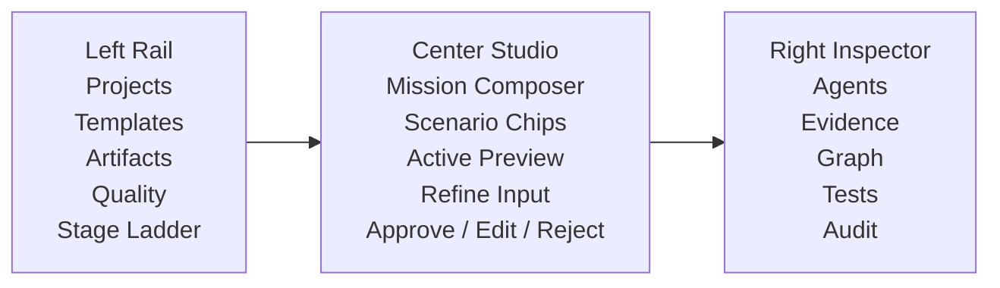

# AI Studio And Apple-Grade Agentic UX Rescue Brief

**NO AI SLOP ALLOWED AT ALL - ZERO TOLERANCE TO SLOP AND HALLUCINATIONS**

## Recovery Truth

The current local control console is useful as an engineering dashboard, but it is not yet a satisfying agentic AI-centric product experience. It shows too many internal objects at once: proof classes, task beads, protocol descriptors, stage maps, skill stacks, evidence records, generated meta-skill JSON, and graph data. That makes the user decode the factory before the factory earns trust.

The next UI pass must not add more panels. It must redesign the first-run experience around a human supervisor journey:

1. Tell the factory what you want.
2. See the selected scenario, template, token band, and approval boundary.
3. Let agents generate or inspect the next proposal.
4. Preview the artifact, app surface, or stage report in the center.
5. Approve, edit, reject, pause, or resteer.
6. Inspect evidence, graph impact, tests, and audit detail only when needed.

## External Design Signals

Google AI Studio Build mode is the right inspiration pattern because it starts from a prompt, generates code/files, shows a live preview, allows iterative chat/annotation refinement, and exposes code and deployment paths later. Source: https://ai.google.dev/gemini-api/docs/aistudio-build-mode

Apple interface guidance is the right bar for restraint: primary content should fit the screen, text must remain legible, controls should be near the content they affect, alignment must reveal relationships, and overlapping text is unacceptable. Source: https://developer.apple.com/design/tips/

Material 3 is the right implementation language for this web console: use semantic color roles, design tokens, accessible color assignment, a stable type scale, surfaces/containers, and high-emphasis color only for the primary action. Source: https://developer.android.com/codelabs/m3-design-theming

## Product Principle

The dark-factory UI is not a documentation portal first. It is an agentic workbench.

The UI should feel like a focused studio where a human is directing an expert delivery firm:

- The main canvas is the current work product or proposal preview.
- The prompt/intake area is the command input, not a buried form.
- The next legal action is always visible and phrased in human language.
- Agent state is visible as a calm activity rail, not a data dump.
- Proof and protocol are inspectable but secondary.
- Resteering is a first-class workflow, not an afterthought.

## New First-Viewport Contract

The first viewport must answer six questions without scrolling:

1. What project or mission am I working on?
2. What can I ask the factory to do right now?
3. What will happen if I press the primary button?
4. Which agent/stage is active?
5. What decision needs my approval?
6. Where can I inspect evidence, graph impact, tests, and audit details?

If any answer requires reading a raw ledger or JSON block, the first viewport fails.

## Information Architecture

### Left Rail

Purpose: stable navigation and project context.

Contents:

- Product mark: Dark Factory Studio.
- Primary nav: Projects, Templates, Artifacts, Quality, Settings.
- Open project selector.
- Current stage ladder with compact statuses.

The rail must not compete with the workbench. It should be narrow, quiet, and persistent.

### Center Studio

Purpose: the human-agent collaboration loop.

Contents:

- Mission composer: one large natural-language input with scenario chips.
- Primary action: Start factory, Generate proposal, Continue stage, or Review decision.
- Active preview: stage proposal, generated artifact summary, app preview, or audit result.
- Refinement input: "Ask the agents to change this..."
- Approval row: Approve, Edit request, Reject, Pause.

The center must be the emotional and functional heart of the app.

### Right Inspector

Purpose: evidence and operational visibility.

Contents:

- Tabs: Agents, Evidence, Graph, Tests, Audit.
- Active agent card.
- Decision queue.
- Proof posture.
- Graph impact summary.
- Latest event stream.

The inspector should be visible but not visually louder than the center canvas.

## Agentic Objects That Must Be Visible

- Scenario route.
- Generated meta-skill mode.
- Current stage and legal next action.
- Human interrupt state.
- Provider quorum or critic panel state.
- Previewable artifact or stage output.
- Evidence count and proof-class posture.
- Graph impact before change.
- Resteer/change-control entry.

## What Must Move Out Of The First Reading Path

- Raw invocation packet.
- Generated meta-skill JSON.
- Full proof-class inventory.
- Full artifact graph.
- Full skill stack descriptions.
- Record path lists.
- Long audit logs.

These remain accessible through the inspector or detail tabs, but they cannot dominate the first screen.

## Visual Direction

Use a calm light Material 3-inspired system with Apple-grade restraint:

- Background: warm neutral surface, not stark white everywhere.
- Primary: Google blue for one dominant call to action only.
- Secondary: restrained green for approved/pass states.
- Warning: amber only for approval or change-control attention.
- Typography: system UI/Inter/Roboto stack, stable sizes, no tiny dense walls.
- Shape: 8px radius for controls and surfaces.
- Spacing: fewer panels, more breathing room, stronger hierarchy.
- Density: show summaries first, reveal detail progressively.

## Screen Sketch

## First-Pass Implementation Scope

This pass should change the local control console experience, not pretend to finish the entire factory:

- Replace the top-heavy command deck with a studio shell.
- Add a large mission composer on the first screen.
- Promote the preview/next decision into the center.
- Move evidence/protocol/graph detail into a right inspector and tabbed detail sections.
- Retain existing endpoints and tests where possible.
- Add a browser screenshot verification gate.

## Acceptance Rubric

The redesign does not pass unless all checks are true:

1. First viewport has one obvious primary action.
2. First viewport has a large natural-language command/composer.
3. First viewport has a center preview/proposal area.
4. First viewport has a right inspector for agents/evidence/graph/tests/audit.
5. Evidence and graph are visible as summaries, not hidden, but full detail is secondary.
6. No raw JSON or path list appears in the first viewport.
7. Stage ladder is compact and readable.
8. User can start a greenfield project from the first screen.
9. User can approve/edit/reject a human interrupt from the first screen.
10. User can switch to evidence, graph, change, and protocol details.
11. Layout has no overlapping text at desktop width.
12. Mobile layout preserves mission composer before internals.
13. Colors use semantic roles and do not become a one-hue wall.
14. Browser smoke test verifies render, start, approval, pipeline, audit, change, and screenshots.
15. Final status language distinguishes implemented UI from descriptor-only factory claims.

## Critic Panel

### Legendary Product Developer / Apple-Grade UX Critic

Rejects any interface that makes the human study internal factory machinery before they can act. Requires clarity, readable hierarchy, one primary action, content-first canvas, and progressive disclosure.

### AI Studio Agentic Workflow Architect

Rejects any interface that is merely a dashboard plus chat. Requires prompt-to-preview loop, iterative refinement, visible generated output, and agent state that supports supervision rather than spectacle.

### Hawkeye TPM / No-Skip Auditor

Rejects any interface that hides legal next action, approval boundary, graph impact, evidence posture, or change-control consequences. Requires that every primary action maps to a stage, gate, and record.

## Decision

Proceed to a constrained first-screen redesign. Do not add new dark-factory promises. The UI must make the existing local factory easier to drive, inspect, and resteer.

## Implementation Pass Evidence

Applied changes:

- Replaced the stacked command/focus deck with a studio shell.
- Added first-screen mission composer, scenario chips, project name, token SWAG, and primary action.
- Added center active-preview canvas with refine/ask input.
- Added right inspector with agent/evidence/handoff/next-action/decision queue summary.
- Moved deeper factory internals behind progressive workspace tabs.
- Fixed a CSS ordering bug where overview panels leaked into other tabs.
- Fixed mobile order so the mission studio appears before the project/stage rail.
- Added the UX rescue gate to the governing meta-attractor, dashboard-control, and quality-refinery skills in both installed and workspace bundles.

Verification:

- `node --check public/app.js`: pass.
- `node --check server.js`: pass.
- `npm test`: pass.
- `npm run test:browser`: pass.
- `validate_skill_bundle.py`: pass.
- `validate_tasks_md.py`: pass.
- Desktop screenshot: `dark-factory-control-console/artifacts/studio-first-viewport-top.png`.
- Browser smoke screenshots: `dark-factory-control-console/artifacts/browser-console-smoke.png` and `dark-factory-control-console/artifacts/browser-console-mobile-smoke.png`.

Residual boundary:

This is a strong local first-screen recovery pass, not a claim that the full hosted product, live multi-provider execution, complete Spec Graph substrate, or all todo/habits product artifacts are finished.
