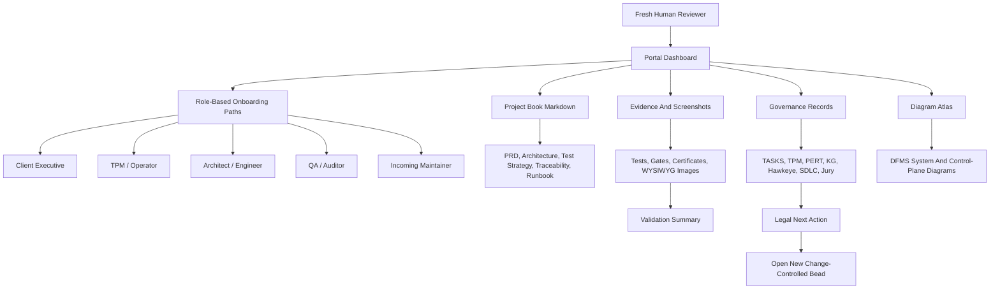
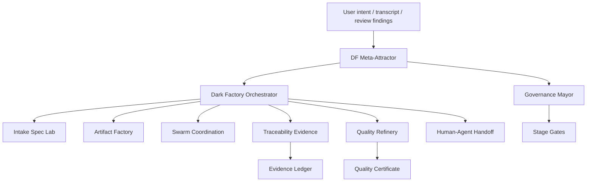
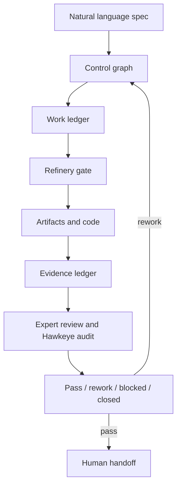
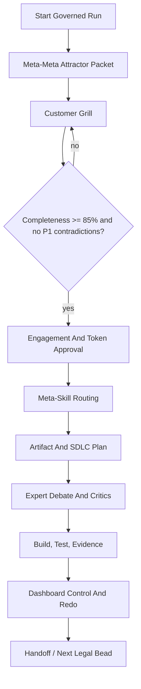
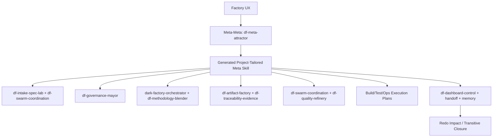
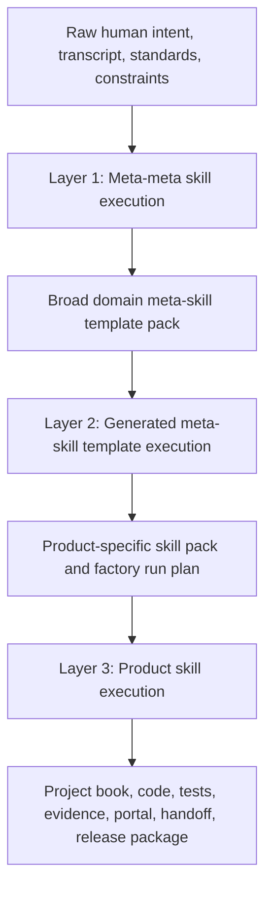
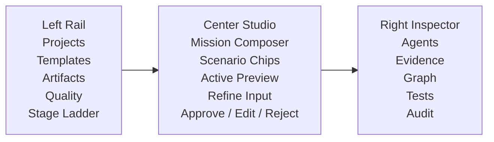

# Mermaid Diagram Atlas

**NO AI SLOP ALLOWED AT ALL - ZERO TOLERANCE TO SLOP AND HALLUCINATIONS**

This atlas indexes the known Mermaid diagrams produced so far for the dark-factory meta-meta work and this project portal.

## Diagram Sources

| ID | Source | Purpose |
|---|---|---|
| `DIA-DFMS-001` | `../../../../dark-factory-meta-skills-design/00-system-design.md` | Meta-attractor and orchestrator system design. |
| `DIA-DFMS-002` | `../../../../dark-factory-meta-skills-design/11-best-of-all-merged-control-plane.md` | Best-of-all merged control plane. |
| `DIA-DFMS-003` | `../../../../dark-factory-meta-skills-design/50-control-console-ui-record.md` | Meta-meta-first control console workflow. |
| `DIA-DFMS-004` | `../../../../dark-factory-meta-skills-design/51-factory-execution-ux-record.md` | Generated meta-skill to child-skill execution flow. |
| `DIA-DFMS-005` | `../../../../dark-factory-meta-skills-design/63-document-generation-layer-map.md` | Three-layer document generation model. |
| `DIA-NORTHSTAR-PORTAL-001` | `project-book/portal/diagrams.md` | Human review portal map. |

## Project Portal Map

## Meta-Attractor System Design Diagram

Source: `../../../../dark-factory-meta-skills-design/00-system-design.md`

## Best-Of-All Merged Control Plane Diagram

Source: `../../../../dark-factory-meta-skills-design/11-best-of-all-merged-control-plane.md`

## Control Console Workflow Diagram

Source: `../../../../dark-factory-meta-skills-design/50-control-console-ui-record.md`

## Factory Execution UX Diagram

Source: `../../../../dark-factory-meta-skills-design/51-factory-execution-ux-record.md`

## Document Generation Layer Map

Source: `../../../../dark-factory-meta-skills-design/63-document-generation-layer-map.md`

## AI Studio Agentic UX Rescue Layout

Source: `../../../../dark-factory-meta-skills-design/68-ai-studio-apple-grade-agentic-ux-rescue-brief.md`

